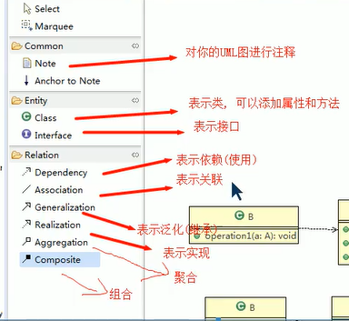

# 设计模式(Design pattern)

# 1.设计模式的目的

编写软件过程中，coder面临来自 耦合性，内聚性以及可维护性，可扩展性，重用性，灵活性等多方面的挑战，设计模式为了让程序（软件）具有更好的

代码重用性（相同的代码，不用多次编写）

可读性（变成规范性，便于其他coder的阅读和理解）

可扩展性（当需要增加新的功能时，非常的方便，称为可维护）

可靠性（当增加新功能后，对原来的功能没有影响）

使程序呈现高内聚，低耦合的特性

## 思想：

1.找出应用中可能需要变化之处，把他们独立出来，不要和那些不需要变化的代码混在一起。

2.针对接口编程，而不是针对实现编程。

3.为了交互对象之间的松耦合设计而努力

# 2.七大原则

### 1.单一职责原则

1. 降低类的复杂度，一个类值负责一项职责。
2. 提高类的可读性，可维护性
3. 降低变更引起的风险
4. 通常情况下，我们应当遵守单一原则，只有逻辑足够简单，才可以在代码级违反单一职责原则“只有类中方法数量足够少，可以在方法级别保持单一职责原则。

DEMO：比如订单类只负责订单、 dao

### 2.接口隔离原则（Interface Segregation principle)

客户端不应该依赖它不需要的接口，即一个类对另一个类的依赖应该建立在最小的接口上

DEMO：拆分接口，类与他需要的接口建立依赖关系  

```java
public class Segregation {
    public static void main(String[] args) {
        A a = new A();
        a.depend1(new B());
    }
}

interface Interface1 {
    void operation1();
}

interface Interface2 {
    void operation2();
    void operation3();
}

interface Interface3 {
    void operation4();
    void operation5();
}

class B implements Interface1, Interface2 {

    @Override
    public void operation1() {
        System.out.println("B 实现operation1");
    }

    @Override
    public void operation2() {
        System.out.println("B 实现operation2");
    }

    @Override
    public void operation3() {
        System.out.println("B 实现operation3");
    }

}

class A {// A类接口通过Interface1 、Interface2 依赖（使用）B类，但只会用到1,2,3方法

    public void depend1(Interface1 i) {
        i.operation1();
    }

    public void depend2(Interface2 i) {
        i.operation2();
    }

    public void depend3(Interface2 i) {
        i.operation3();
    }
}
 
```


### 3.依赖倒转

1. 高层模块不应该依赖底层模块，二者都应该**依赖其抽象**

2. 抽象不应依赖细节，细节应该依赖抽象

3. 依赖倒转的中心思想是面向接口编程

4. 依赖倒转原则是基于：相对于细节的多边性，**抽象的东西要稳定的多**，以抽象为基础搭建的架构比以细节为基础的架构要稳定的多，在java中，抽象指的是接口或抽象类，细节就是具体的实现类，

5. 使用接口或抽象类的目的是制定好规范，而不涉及任何具体的操作，把展现细节的任务交给他们的实现类去完成

   **依赖传递分三种方式：**

   1通过**接口传递**实现依赖。

   ```java
   interface IOpenAndClose{
   	public void open(ITV tv);//抽象方法，接收接口
   }
   
   interface ITV{//ITV接口
   	public void play();
   }
   
   //实现接口
   class OpenAndClose implements IOpendAndClose{
       public void open(ITV tv){
           t.paly();
       }
   }
   ```

   2.通过**构造方法**依赖传递。

   ```java
   interface IOpenAndClose{
   	public void open();//抽象方法
   }
   
   interface ITV{//ITV接口
   	public void play();
   }
   
   //实现接口
   class OpenAndClose implements IOpendAndClose{
   	public ITV tv;//成员
   	public OPenAndClose(ITV tv){//构造器
   		this.tv = tv;
   	}
       public void open(){
           this.tv.paly();
       }
   }
   ```

   3.通过**setter**方法传递

   ```java
   interface IOpenAndClose{
   	public void open();//抽象方法
       public void setTv(ITV tv);
   }
   
   interface ITV{//ITV接口
   	public void play();
   }
   
   class OPendAndClose implements IOpenAndClose{
       private ITV tv;
       public void setTv(ITV tv){
           this.tv = tv;
       }
       public void open(){
   		this.tv.play();
       }
   }
   ```

注意点：

1.底层模块尽量都要有抽象类或接口，或者两者都有，程序稳定性更好。

2.变量的声明类型尽量使抽象类或接口，这样我们的变量引用和实际对象间，就存在了一个缓冲层，利于程序扩展和优化。

3.继承时遵循里氏替换原则

### 4.里氏替换原则

1.**尽量不要重写父类的方法**

2.所有引用基类的地方必须能透明地使用其子类的对象

3.在适当的情况下，可以通过聚合，组合，依赖来解决问题

### 5.开闭原则(Open Closed Principle)

1.变成最基础，组重要的原则

2.一个软件实体如类，模块和函数应该**对扩展开放**（对提供方），**对修改关闭**(对使用方)，用抽象构建框架，用实现扩展细节。

3.当软件需要变化时，尽量通过扩展软件实体的行为来实现变化，而不是通过修改已有的代码来实现变化。

4.变成中遵循其他原则，以及使用设计模式的目的就是遵循开闭原则。

### 6.迪米特法则

1. 一个对象应该对其他对象保持最少的了解（**降低类之间的耦合**）
2. 类和类关系约密切，耦合度越大
3. 迪米特法则=**最少知道原则**
4. 只与直接的朋友通信
5. 直接的朋友：每个对象都会与其他对象有耦合关系，只要两个对象之间有耦合关系，我们就说这两个对象之间是朋友关系。耦合的方式很对，依赖，关联，组合，聚合。如果出现成员变量，方法参数，方法返回值中的类为直接朋友，而出现在局部变量中的类不是直接朋友。 陌生的类最好不要以局部变量形式出现在类的内部。

### 7.合成复用原则

1. 尽量使用合成/聚合的方式，而不是使用集成

   ```
   B用A：
   
   1.依赖虚线连接右箭头
   opreation(a:A)
   
   2.聚合（空心菱形在左）
   a:A
   SetA（a:A）
   
   3.组合（实心菱形在左）
   a:A = new A()
   ```

   

# 3.UML

 

Dependency 依赖（使用）

Association 关联（1-N）

Generalization 泛化（继承）

Realization 实现 (implements 接口 实现方法)

Aggregation 聚合  例如 set方法传递

Composite :组合  A,B    a:A = new A（）； B实例化时 a成员变量也实例化了

# 4.创建型

单例模式

简单工厂

工厂方法

抽象工厂

生成器

原型模式

# 5.结构型

外观

适配器

桥接

组合

装饰器（Decorator）  

享元

代理

# 6.行为型


策略（strategty)  

模板

命令

观察者（Observer）  

访问者

状态

解释器

迭代器

中介者

备忘录


