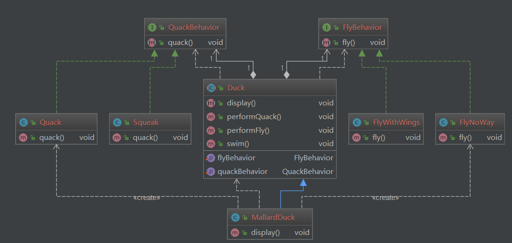

# 策略模式（Strategy pattern）
> 策略模式（Strategy parttern) :定义了算法族，分别封装起来，让他们之间可以互相替换，此模式让算法的变化独立于使用算法的客户。
## 意图：
定义一系列的算法，把他们一个个封装起来，并且使他们可互相替换。
## 主要解决：
在有多种算法相似的情况下，使用if...else所带来的复杂和难以维护
## 何时使用：
一个系统有许多许多类，而区分它们的只是他们直接的行为。
## 如何解决：
将这些算法封装成一个一个的类，任意地替换。
## 关键代码：
实现同一个接口。
## 应用实例： 
1、诸葛亮的锦囊妙计，每一个锦囊就是一个策略。 2、旅行的出游方式，选择骑自行车、坐汽车，每一种旅行方式都是一个策略。 3、JAVA AWT 中的 LayoutManager。
## 优点： 
1、算法可以自由切换。 2、避免使用多重条件判断。 3、扩展性良好。
## 缺点： 
1、策略类会增多。 2、所有策略类都需要对外暴露。
## 使用场景： 
1、如果在一个系统里面有许多类，它们之间的区别仅在于它们的行为，那么使用策略模式可以动态地让一个对象在许多行为中选择一种行为。 2、一个系统需要动态地在几种算法中选择一种。 3、如果一个对象有很多的行为，如果不用恰当的模式，这些行为就只好使用多重的条件选择语句来实现。
## 注意事项：
如果一个系统的策略多于四个，就需要考虑使用混合模式，解决策略类膨胀的问题。
## 类图
QuackBehavior、FlyBehavior 接口各定义了一个算法族，它们都具有 behavior() 方法。 
MallardDuck 是使用到该算法族的类，其中的 performFly、 performQuack会调用 behavior()， setFlyBehavior(FlyBehavior flyBehavior)、 setQuackBehavior(QuackBehavior quackBehavior)方法可以动态地改变 Duck 对象，也就是说能动态地改变 MallardDuck 所使用的算法。

